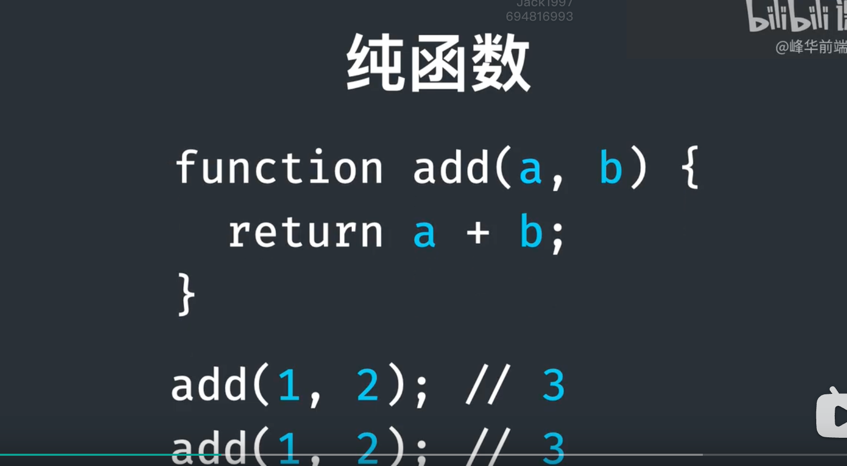
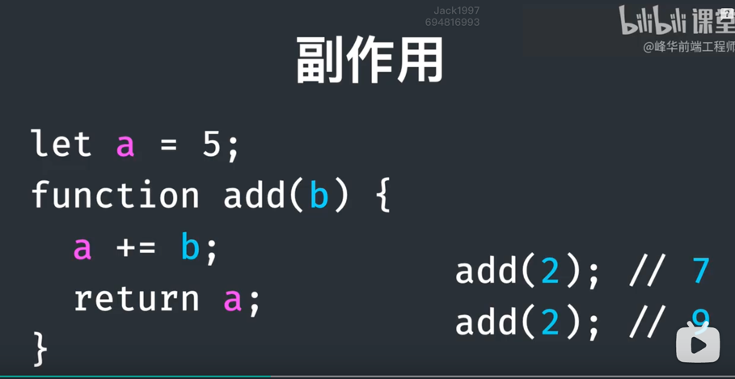
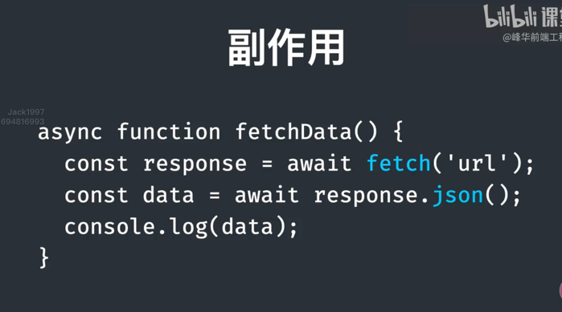
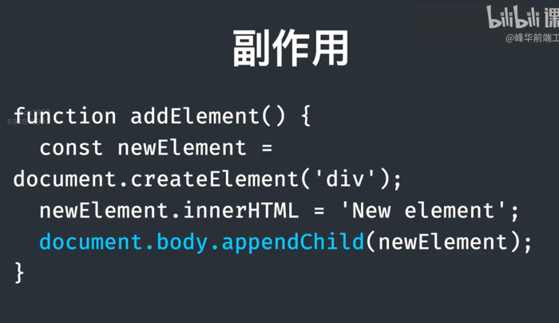
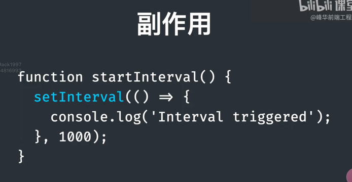
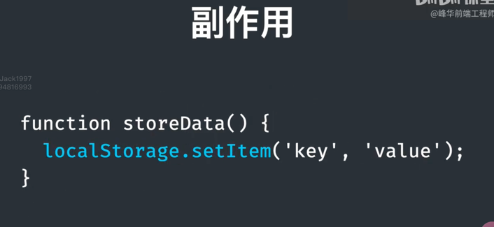
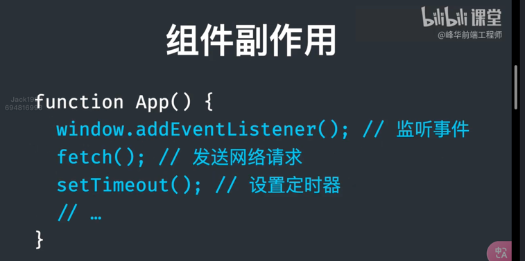

# React + Vite

This template provides a minimal setup to get React working in Vite with HMR and some ESLint rules.

Currently, two official plugins are available:

- [@vitejs/plugin-react](https://github.com/vitejs/vite-plugin-react/blob/main/packages/plugin-react/README.md) uses [Babel](https://babeljs.io/) for Fast Refresh
- [@vitejs/plugin-react-swc](https://github.com/vitejs/vite-plugin-react-swc) uses [SWC](https://swc.rs/) for Fast Refresh
## 纯函数
··· 传递相同的参数，返回结果相同，且不会有其他意外情况出现
 

## 副作用
修改了外部的变量（外部环境 ），返回的结果及有可能不同，发生了意外情况 称之为side effect

副作用包括例如
+ 发送网络请求获取数据，可能因为网络错误导致不同的结果，异常或成功

+  修改DOM

+ 设置定时器

+ 修改localStorage

在react中，如果组件内部发生了这些行为的话，及称为组件的副作用
 

## 关于函数式编程
https://www.ruanyifeng.com/blog/2017/02/fp-tutorial.html
